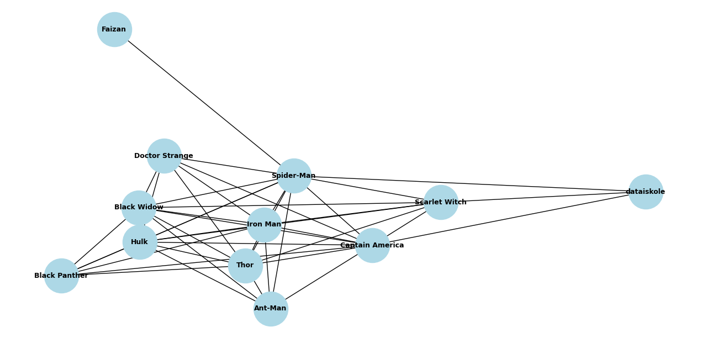

# Superhero Universe Network Analysis

This project is part of the **Dataiskole Internship Take-Home Assignment**, where we analyze and visualize a superhero universe network. Each superhero is a node, and each friendship is a connection (edge) in the network.


---

## Tech Stack

- **Python 3**
- `pandas` – Data loading and manipulation
- `networkx` – Network analysis and graph building
- `matplotlib` – Graph visualization
- `datetime` – Date filtering logic

---

## Features

### ✅ Core Requirements
- ✅ Load superheroes and connection data from CSV
- ✅ Show total number of superheroes
- ✅ Show total number of connections
- ✅ List superheroes added in the last 3 days
- ✅ Identify the top 3 most connected superheroes
- ✅ Analyze the new superhero `dataiskole`:
  - When they were added
  - Who their friends are

### Bonus Features
-   **Graph Visualization**  
  Automatically generates a graph layout of superheroes and their friendships using `networkx` and `matplotlib`.

-  **Add New Superheroes and Connections**  
  Users can interactively add new superheroes and friendship links using the CLI.

---

##  Screenshots

<p align="center">
  
</p>

---

## How to Run the Project

### 1. Clone the repository

```bash
git clone https://github.com/faizansafwan/spr-hero-network.git
cd spr-hero-network
```

### 2. Install python libraries
```bash
pip install pandas networkx matplotlib
```

### 3. Run the program
```bash
python app/superhero_network.py
```
